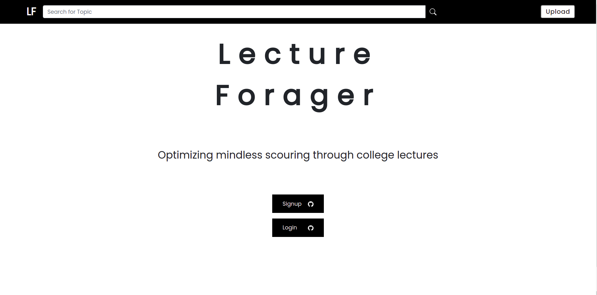
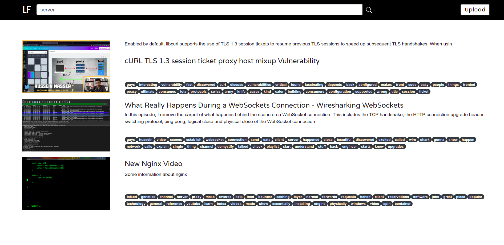
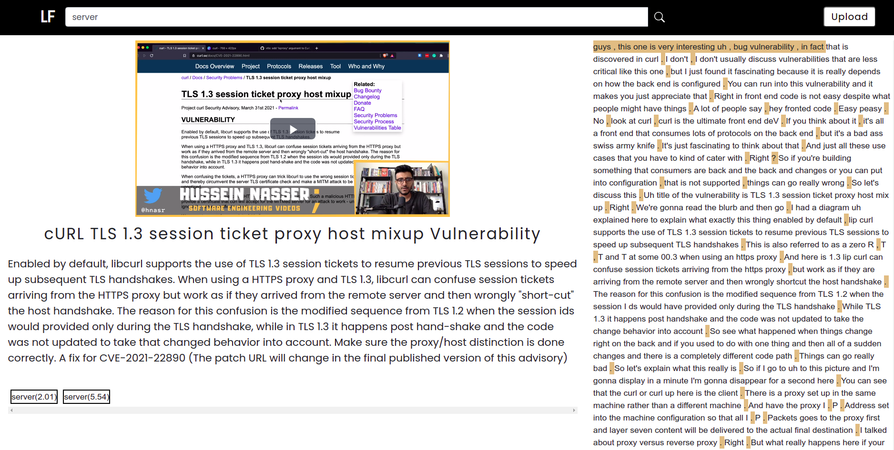

# Lecture Forager
## A search engine on instances of lecture videos to allow selective topics instead of watching the whole lectures

## Tech

## Architecture

## Final PPT
 [Amazon HackOn](https://docs.google.com/presentation/d/1BHECZ3y1uM5yhqO-iKB7efPvNsr7rB36qsYkS9SbJ60/edit)

## Some resources to start the hack:
- [Building a video search engine](https://towardsdatascience.com/building-a-video-search-engine-b93305126b59)
- [Elastic Search](https://towardsdatascience.com/building-a-video-search-engine-b93305126b59)
- [Amazon Transcribe](https://us-east-2.console.aws.amazon.com/transcribe/home?region=us-east-2#welcome)
- [Elastic Search](https://blog.logrocket.com/full-text-search-with-node-js-and-elasticsearch-on-docker/)
- [AWS Architecture for Video Upload](https://aws.amazon.com/blogs/machine-learning/analyzing-contact-center-calls-part-1-use-amazon-transcribe-and-amazon-comprehend-to-analyze-customer-sentiment/)
- [Chunking video for effecient send using HTTP]()
- [Connecting AWS Transcribe with AWS and Lambda](https://towardsdatascience.com/speech-to-text-using-aws-transcribe-s3-and-lambda-a6e88fb3a48e)
- [Clean Architecture by Uncle Bob](https://blog.cleancoder.com/uncle-bob/2012/08/13/the-clean-architecture.html)
- [GitFlow](https://www.atlassian.com/git/tutorials/comparing-workflows/gitflow-workflow)
- [S3 Trigger for Lambda Function](https://docs.aws.amazon.com/lambda/latest/dg/with-s3-example.html)

## FULL TEXT SEARCHES IN DATABASES ARTICLES
- [Keyword search in Mongo](https://stories.mlh.io/full-text-search-in-minutes-with-mongodb-atlas-602f9e163ca6)
- [Full Text Search in Mongo](https://code.tutsplus.com/tutorials/full-text-search-in-mongodb--cms-24835)
- [Another FTS in Mongo](https://deniseyu.github.io/full-text-search-mongodb/)
- [FTS in Postgres](https://alibaba-cloud.medium.com/using-postgresql-to-create-an-efficient-search-engine-d0ab8e11b7)

## Good to have features:
1. Integration with other services like teams, google meet, webex to directly stream the current video for transcribing.
2. Partition the available video into chunks according to topics being discussed
3. Finding out keywords from the transcription and removing ordinary and common words (a developer side thing but might improve search results)
4. Adding subtitles to the video
5. Summarizing a particular chunk of transcription to create sort of notes. (text summarization)

## Figma Design Link
[Figma](https://www.figma.com/file/8GuB6KhRG1FmoFoTFN3DcE/Lecture-Forager?node-id=0%3A1) 
